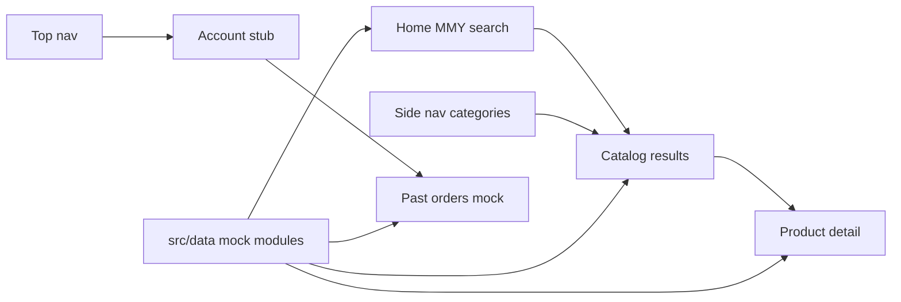

# Architecture

Vite + React SPA. Phase 1 uses typed mock data that mirrors a future API so the UI can be approved before a backend exists.

## Stack (current)

- Vite 8, React 19, TypeScript
- Tailwind CSS 4 + shadcn/ui (`base-mira`, path alias `@/`)
- Theme: light default + dark via `ThemeProvider` — see [design-system.md](./design-system.md)
- Routing: **React Router** (to be added in Phase 1 implementation)

Details and non-goals: [infrastructure.md](./infrastructure.md).

## Proposed `src/` layout

```
src/
  assets/           # images, logos
  components/
    ui/             # shadcn primitives
    layout/         # shell, top bar, sidebar
    catalog/        # MMY search, product lists, filters
    account/        # account/order stubs
  data/             # mock modules (vehicles, products, fitments, articles, orders)
  docs/             # this folder (agent docs only)
  hooks/
  lib/              # utils (cn, helpers)
  pages/            # route-level screens
  types/            # shared domain types matching schema.md
  App.tsx
  main.tsx
  index.css
```

## Routing map (Phase 1)

| Path | Page | Purpose |
|------|------|---------|
| `/` | Home | Brand + MMY search form (primary CTA) |
| `/catalog` | Catalog | Filtered product list (query from MMY or sidebar) |
| `/catalog/:categorySlug` | Category | Products (or articles) in a sidebar category |
| `/products/:slug` | Product detail | Specs, fitment, price, description |
| `/info/:slug` | Article | Automotive information content |
| `/account` | Account stub | Login placeholder + past orders (mock) |
| `/account/orders` | Orders stub | List of mock past orders |

Query params on `/catalog` may include `make`, `model`, `year` from the home search.

## Data flow



## Mock data layer

- Types live in `src/types/` and match [schema.md](./schema.md).
- Data lives in `src/data/` as TypeScript modules (or JSON imported into typed modules).
- Prefer small query helpers, e.g. `getProductsByFitment(make, model, year)`, `getProductBySlug(slug)`, `getCategories()`, so pages never hardcode arrays inline.
- When a real API arrives, replace `src/data/` implementations; keep types and page contracts stable.

## Layout shell

- **Top bar**: logo / brand, theme toggle, account link
- **Left sidebar**: sticky/collapsible; parts categories + automotive info links
- **Main**: route content (home search, catalog table/list, product detail)
- Design for a **heavy catalog**: dense, scannable lists and filters over sparse marketing cards — see [design-system.md](./design-system.md)

## Agent rules

- Do not invent a separate backend, CMS, or auth provider in Phase 1.
- Do not put business logic only in components; keep catalog queries in `src/data/` (or thin hooks that call it).
- Update this doc when routes or folder layout change.
