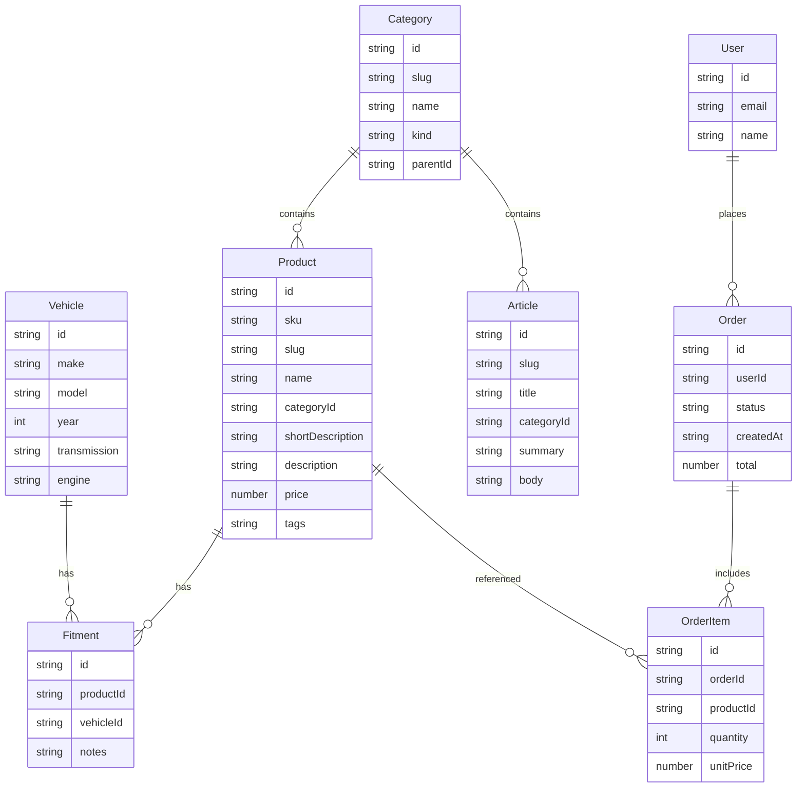

# Schema

Domain model for Phase 1 mock data and a future database. TypeScript types in `src/types/` should match these shapes.

## Entity relationship



## Entities

### Vehicle

Used by MMY search and fitment lookups.

| Field | Type | Notes |
|-------|------|--------|
| `id` | string | Stable mock/DB id |
| `make` | string | e.g. `"Ford"` |
| `model` | string | e.g. `"F-150"` |
| `year` | number | e.g. `1995` |
| `transmission` | string? | Optional fitment nuance |
| `engine` | string? | Optional fitment nuance |

### Category

Sidebar navigation for parts and info.

| Field | Type | Notes |
|-------|------|--------|
| `id` | string | |
| `slug` | string | URL segment |
| `name` | string | Display label |
| `kind` | `"parts"` \| `"info"` | Controls sidebar grouping |
| `parentId` | string? | Optional nesting |
| `description` | string? | Short blurb |
| `sortOrder` | number | Sidebar order |

### Product

Catalog item (torque converters and related parts).

| Field | Type | Notes |
|-------|------|--------|
| `id` | string | |
| `sku` | string | Human-facing part number |
| `slug` | string | URL segment |
| `name` | string | |
| `categoryId` | string | FK → Category |
| `shortDescription` | string | List/card blurb |
| `description` | string | Detail page body |
| `specs` | Record\<string, string\> | Key/value technical specs |
| `price` | number | Display price (USD for mocks) |
| `images` | string[] | Paths or URLs |
| `tags` | string[] | e.g. `["classic", "4wd"]` |
| `inStock` | boolean | Mock availability |

### Fitment

Many-to-many between Product and Vehicle — **core of MMY search**.

| Field | Type | Notes |
|-------|------|--------|
| `id` | string | |
| `productId` | string | FK → Product |
| `vehicleId` | string | FK → Vehicle |
| `notes` | string? | e.g. transmission-specific |

### Article

Automotive information pages for the info side of the catalog.

| Field | Type | Notes |
|-------|------|--------|
| `id` | string | |
| `slug` | string | |
| `title` | string | |
| `categoryId` | string | FK → Category (`kind: "info"`) |
| `summary` | string | List teaser |
| `body` | string | Markdown or plain text for Phase 1 |
| `publishedAt` | string | ISO date |

### User / Order / OrderItem

Sketched for account stubs and Phase 2+. Phase 1 may ship a few mock orders only.

**User:** `id`, `email`, `name`

**Order:** `id`, `userId`, `status` (`pending` \| `processing` \| `shipped` \| `completed` \| `cancelled`), `createdAt` (ISO), `total`

**OrderItem:** `id`, `orderId`, `productId`, `quantity`, `unitPrice`

## Example JSON shapes

```json
{
  "id": "veh_ford_f150_1995",
  "make": "Ford",
  "model": "F-150",
  "year": 1995,
  "transmission": "E4OD",
  "engine": "5.0L"
}
```

```json
{
  "id": "prod_tc_classic_001",
  "sku": "BNI-TC-CL-001",
  "slug": "classic-lockup-converter-10in",
  "name": "Classic Lock-Up Converter 10\"",
  "categoryId": "cat_torque_converters",
  "shortDescription": "Remanufactured lock-up converter for classic truck applications.",
  "description": "Custom remanufactured torque converter built for rebuilders...",
  "specs": {
    "diameter": "10 in",
    "stall": "1800-2200",
    "lockup": "Yes"
  },
  "price": 429.0,
  "images": ["/images/products/tc-classic-001.jpg"],
  "tags": ["classic", "reman"],
  "inStock": true
}
```

```json
{
  "id": "fit_001",
  "productId": "prod_tc_classic_001",
  "vehicleId": "veh_ford_f150_1995",
  "notes": "E4OD applications"
}
```

## Query helpers (expected)

Implement in `src/data/` (names can vary; behavior should match):

- `listMakes()` / `listModels(make)` / `listYears(make, model)`
- `getProductsByFitment(make, model, year)`
- `getProductBySlug(slug)`
- `getCategories(kind?)`
- `getArticlesByCategory(categoryId)` / `getArticleBySlug(slug)`
- `getOrdersByUserId(userId)` — mock only in Phase 1

## Future DB notes

- Prefer stable string IDs in mocks that can map to UUIDs later.
- Fitment is the join table; index `(make, model, year)` via Vehicle + Fitment for search performance later.
- Do not introduce a second competing schema in UI code without updating this doc.
